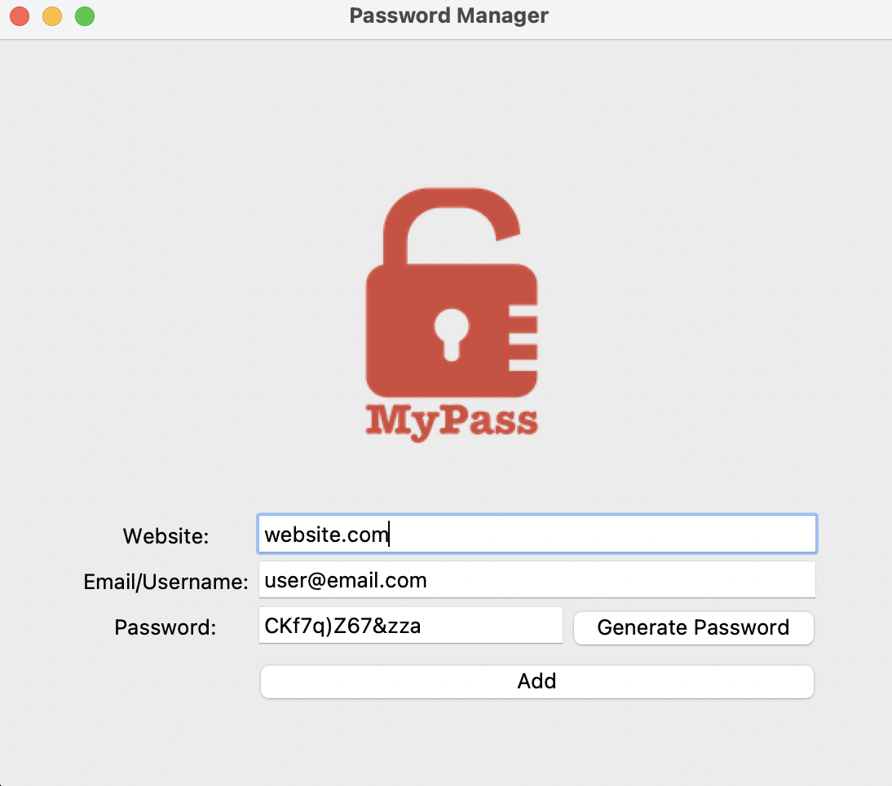

````markdown
# Password Manager GUI

A simple desktop application built with Python and Tkinter that allows users to generate strong, random passwords and save their credentials securely to a local file.



## 🌟 Features

- **Generate Strong Passwords:** Creates a secure password with a randomized combination of letters, numbers, and symbols with a single click.
- **Auto-Copy to Clipboard:** The generated password is automatically copied to the clipboard for ease of use.
- **Save Credentials:** Store website URLs, email/usernames, and passwords in a local `data.txt` file.
- **Simple & Intuitive UI:** A clean and user-friendly graphical interface built with Python's native Tkinter library.
- **Confirmation Dialogs:** Asks for user confirmation before saving data to prevent accidental entries.

## 🛠️ Technologies Used

- **Python 3**
- **Tkinter:** For the graphical user interface.
- **Pyperclip:** A cross-platform Python module for copy and paste clipboard functions.

## ⚙️ Setup and Installation

Follow these steps to get the application running on your local machine.

### Prerequisites

- Python 3.x installed on your system.
- The `logo.png` image file must be in the same directory as the script.

### Installation

1. **Clone the repository:**
    ```bash
    git clone https://github.com/your-username/your-repository-name.git
    cd your-repository-name
    ```

2. **Install the required Python package:**
    The application uses the `pyperclip` library. Install it using pip:
    ```bash
    pip install pyperclip
    ```

## 🚀 How to Run

Execute the main Python script from your terminal (make sure the script is named `main.py` or update the command accordingly).

```bash
python main.py
````

The Password Manager window will appear, ready for use.

## 📂 File Structure

```bash
/Password-Manager-GUI
|
|-- main.py           # The main Python script for the application
|-- logo.png          # The logo image displayed in the application
|-- data.txt          # File where credentials are saved (created automatically on first save)
|-- README.md         # This README file
```

## ⚠️ Important Security Note

```text
This is a portfolio project designed to demonstrate GUI programming and file handling skills in Python.
The credentials are saved in a plain text file (data.txt). This is NOT secure for storing real-world, sensitive passwords.
For actual use, sensitive data should always be encrypted.
```

## 🔮 Future Improvements

```text
[ ] Implement strong encryption (e.g., using the cryptography library) for the data.txt file.
[ ] Add a "Search" feature to find saved credentials for a specific website.
[ ] Add functionality to edit or delete existing entries.
[ ] Refactor the code into a class-based structure for better organization and scalability.
```
